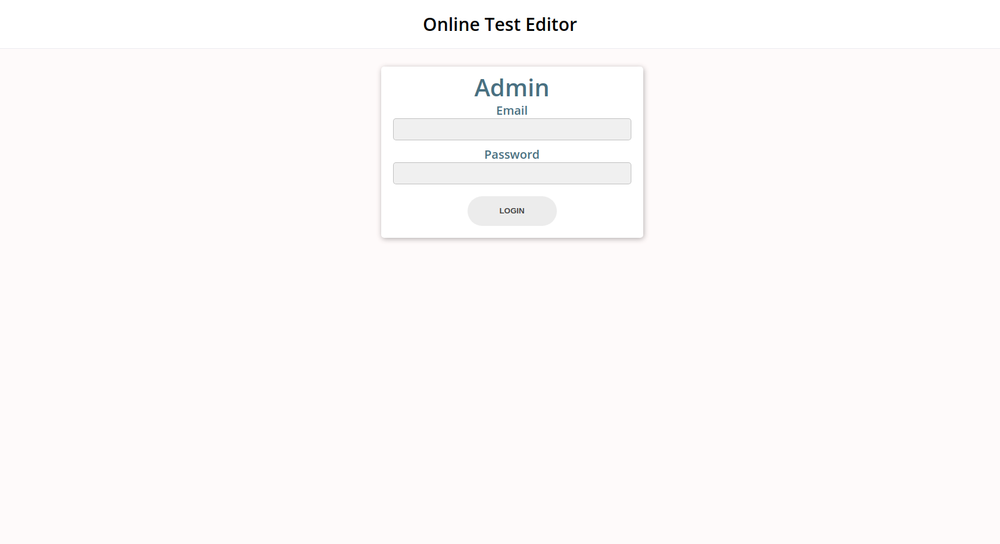
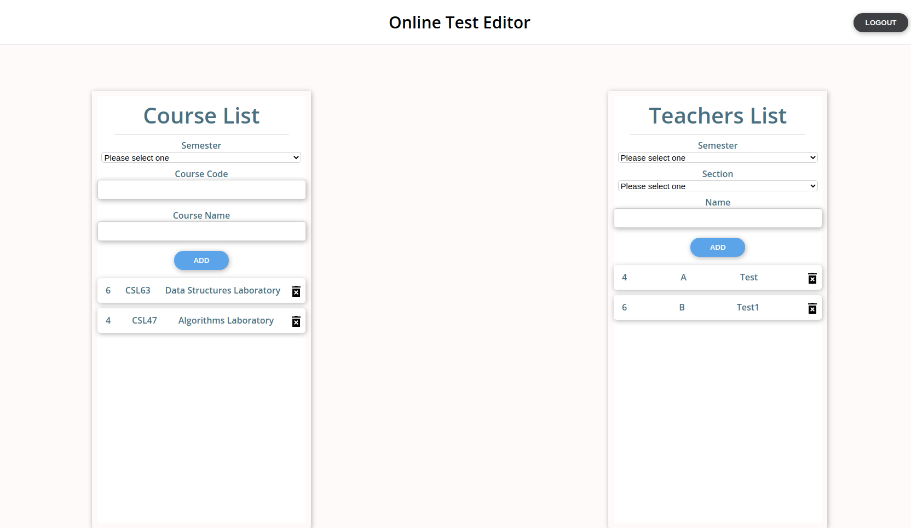
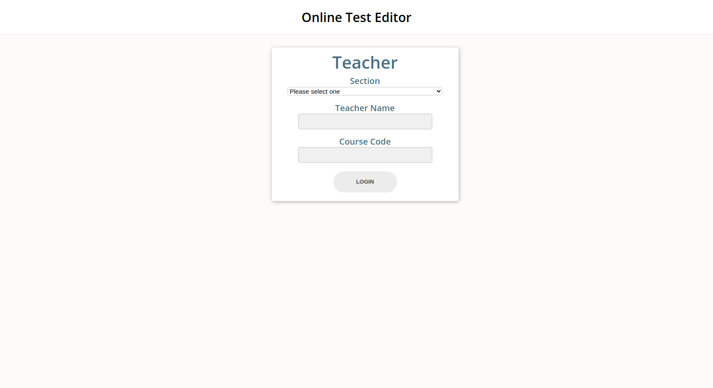
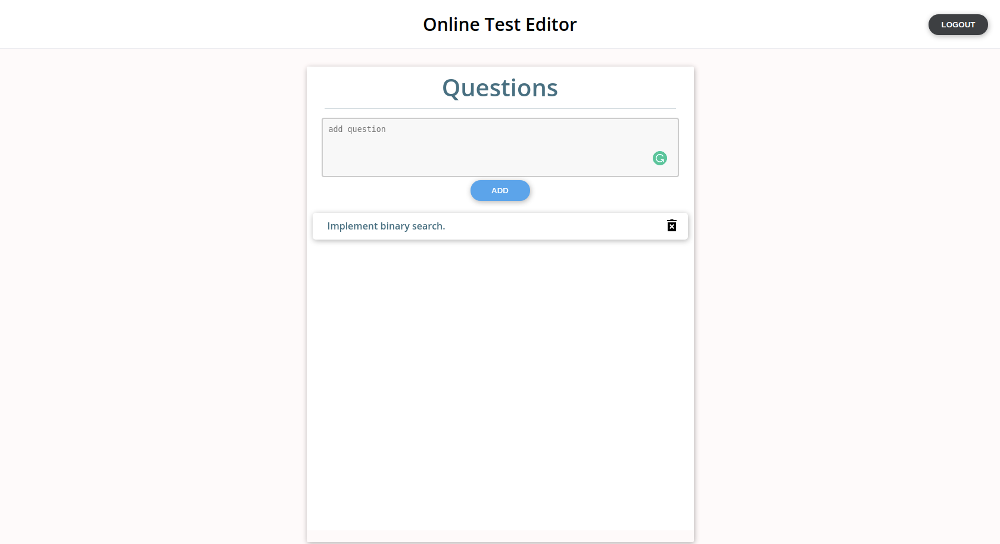
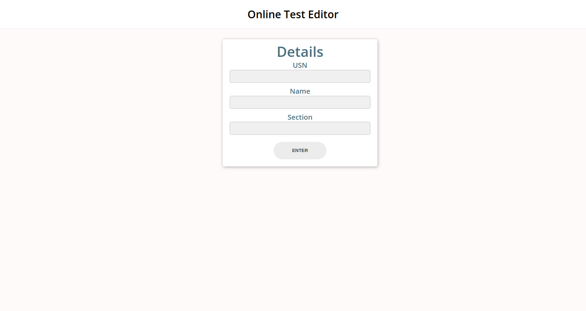
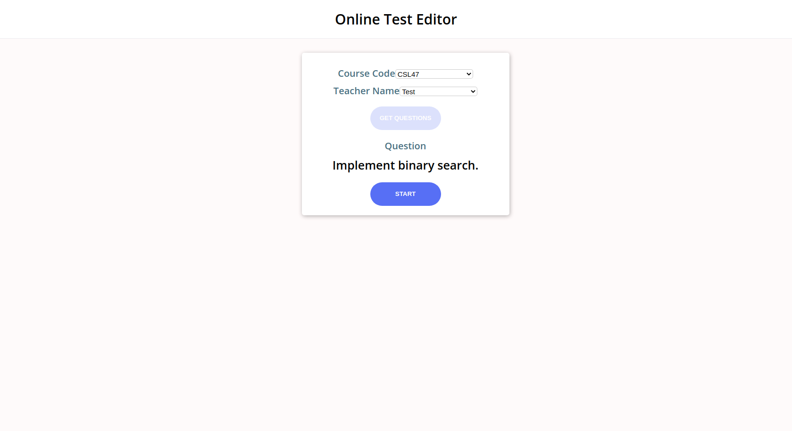
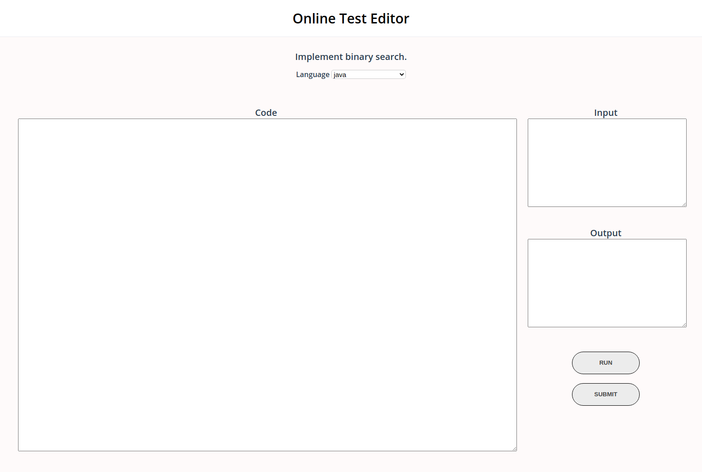

# Online Test Editor

### Project setup

```
git clone https://github.com/vinod2305/Shopping-RESTapi.git
cd Shopping-RESTapi
npm install
```

### Running the project
```
npm install
```


## Tech Stack
- **Frontend**: Vue.js
- **Additional NPM Libraries**
   - vuex
   - vue-router
   - Axios
   - firebase
- **Styling**: SCSS 
- **Database**: Cloud Firestore
- **Storing submissions**: Firebase Storage


## Functionality 
+ Portal for admin to add teachers and courses.
+ Portal for teachers to questions for their respective section students.
+ Students log in with their college credentials
+ Random question is allotted to the students based on the questions entered by their teachers.
+ Editor to write and test code.


## Screenshots







